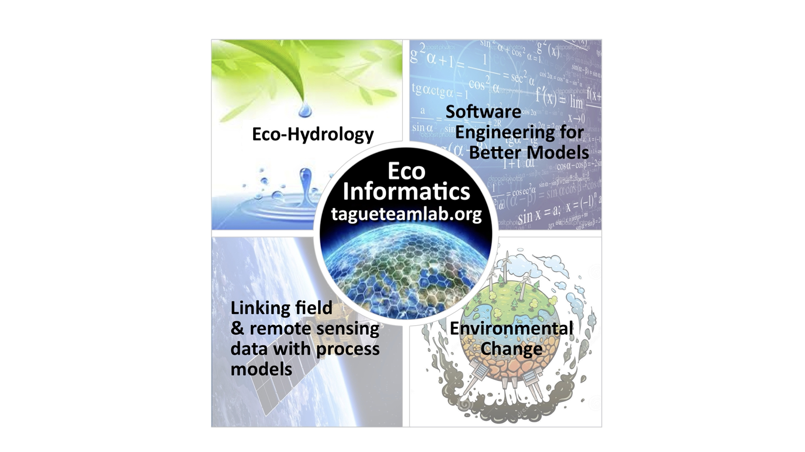

```{r setup, include=FALSE}
knitr::opts_chunk$set(echo = FALSE)
```

## A bit about me

```{r, out.width = "90%", out.height="90%",fig.cap = "Growing skills"}



```

## [Course description]{style="color:orange"}

ESM 262 is an introduction to computing for environmental applications. The course provides practical training in software design best practices.

-   programming language concepts
-   loops and repetition
-   data types and structures
-   modular program design;
-   reproducibility and version control;
-   testing, documentation, and workflow;

The course features **R** for programming, **Git** for version control, **Quarto** for workflow and editing, and **GitHub** for collaboration and publishing, but many concepts would be applicable in other software design tools.

Class will include a mix of lectures and hands-on examples, using students' own computers.

## [Course where and when]{style="color:orange"}

**T/TH** 8:00 AM - 9:15 AM (Bren Hall 1414)

Teaching Team

**Instructor:** Naomi Tague (www.tagueteamlab.org)

-   **Office hours:** email me
-   **email** (tague\@ucsb.edu)
-   **git user id** naomitague

**Teaching assistant:** Ojas Sarup

-   **Office hours:** TBD
-   **email** (ojassarup\@ucsb.edu )
-   **git user id** osarup

## [Learning objectives]{style="color:orange"}

-   practice partner coding and reproducible workflows

-   3 *BIG* concepts in programming are *modularity*, *data structure*, *repetition* - we will learn skills related to all three of these

-   learn and practice some coding/programming best practices (that will make your data science life easier - whatever you do!)

    -   documentation
    -   testing
    -   reproducibity

-   learn some new Rskills that are helpful for a wide variety of data science applications

## [Computing set up]{style="color:orange"}

-   R, R-studio

-   Please bring your laptop to class

## [Course materials and how we will work]{style="color:orange"}

All lecture materials will be available on this course website as well as assignments. (But you will submit assignments on Canvas)

Prior to many classes, I will ask you to study an Quarto document (and often an example R-functions) before class Then at the beginning of class, I will **briefly** go over the document and we will discuss any questions. Occasionally I spend 10-15 minutes lecturing. We will spend most of the class working on practical applications of what was in the document. This way we use the class time as a lab - where you can get guidance.

**this mean its essential for you to do the review before class**

Why structure it this way? You learn to code by doing - not so much by watching others do!

## [Topics]{style="color:orange"} {.scrollable}

```{r, sch}

#| echo: false
#| message: false
library(dplyr)
library(knitr)

# Generate Tue/Thu dates from Apr 14 (first Tuesday) through Jun 4 2026
dates <- seq(as.Date("2026-04-14"), as.Date("2026-06-04"), by = "day")
class_dates <- dates[weekdays(dates) %in% c("Tuesday", "Thursday")]

# Build the data frame
schedule <- data.frame(
  Lecture = seq_along(class_dates),
  Date = format(class_dates, "%a, %b %e"),
  Type = "Regular",
  Topic = c(
    "Course overview and setup",
    "Quarto",
    "Git and GitHub",
    "Git and conflicts",
    "APIs and servers",
    "Data Types and Structures, Strings and Dates",
    "Data structures - Lists",
    "Loops",
    "Functions 2",
    "Repeating",
    "Flow Control",
    "Modular design",
    "Working with the shell",
    "Testing and debugging",
    "Documentation",
    "Where does AI fit"
  )
)

# Evening lectures: Mondays May 11 and May 18, 2026
# Insert after May 7 (Thu) and May 14 (Thu)
evening_rows <- data.frame(
  Lecture = NA,
  Date = format(as.Date(c("2026-05-11", "2026-05-18")), "%a, %b %e"),
  Type = "Evening",
  Topic = c(
    "Functions!",
    "Project Design, Modularity and Workflow - Practicing"
  )
)

idx_may7  <- which(class_dates == as.Date("2026-05-07"))
idx_may14 <- which(class_dates == as.Date("2026-05-14"))

schedule <- bind_rows(
  schedule[1:idx_may7, ],
  evening_rows[1, ],
  schedule[(idx_may7 + 1):idx_may14, ],
  evening_rows[2, ],
  schedule[(idx_may14 + 1):nrow(schedule), ]
) |>
  mutate(Lecture = row_number())

# Render table
kable(
  schedule |> select(Lecture, Date, Type, Topic),
  col.names = c("#", "Date", "Type", "Topic"),
  align = c("r", "l", "l", "l")
)
```

## [Assignments]{style="color:orange"}

There will be 8 assignments (more or less one for each week). You will usually have time to work on the assignment in class and most will be in groups.

# Assignment materials and dates

| Week | Name                         | Assigned   | Due date   | Group (G) |
|------|------------------------------|------------|------------|-----------|
| 1    | Quarto Intro              | 2026-04-16 | 2026-04-21 | G         |
| 2    | Git             | 2025-04-21 | 2025-04-28 | I         |
| 3    | Using Git with your function | 2025-02-25 | 2025-03-03 | I         |
| 4    | Data Structure                     | 2025-03-4  | 2025-03-10 | I         |
| 5    | Functions and testing        | 2025-3-11  | 2025-3-18  | G         |

# Assignment expectations and grading

-   All assignments submitted on Canvas
-   Late Assignments 10% each day. Try to submit on time as we build on the concepts and materials covered in each assignment
-   Style counts; So make sure your follow good programming practices including adding documentation and using informative variable names
-   You can use AI (ChatGPT etc) to help you learn syntax, but write the code yourself; this is how you learn
-   You can resubmit your assignment for additional feedback and we will upgrade your grade. Please do so with in one week of getting the assignment back
