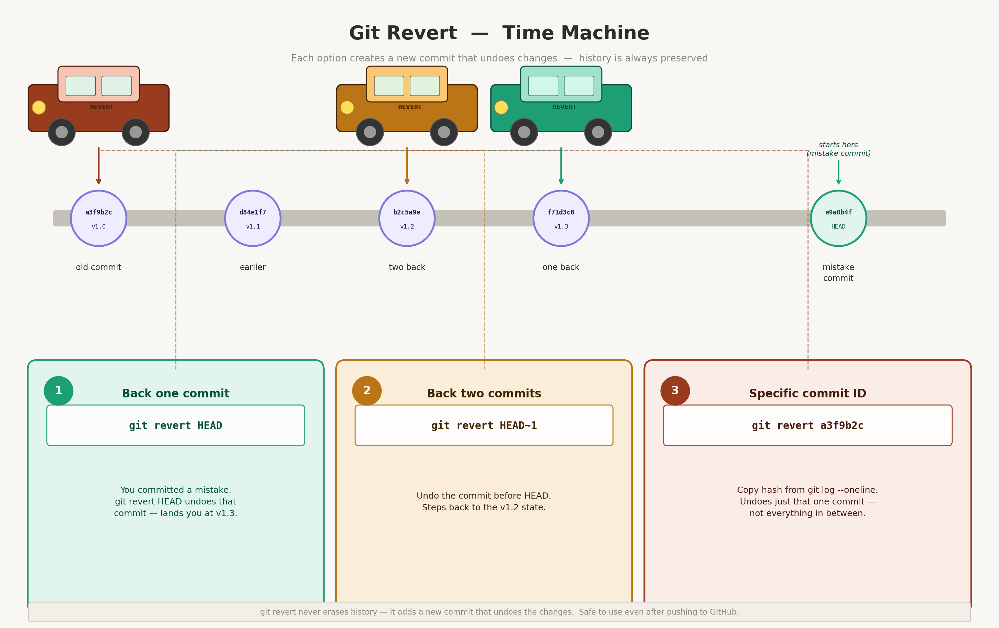
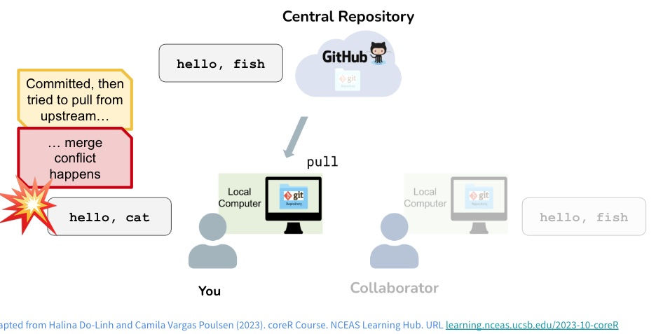

```{r, setup, echo=FALSE, eval=TRUE, message=FALSE, warning=FALSE}
library(here)
library(tidyverse)
```

## Git


## The Basics {.scrollable}

[Commit]{style="color:green"}

-   saves the current version locally each commit has a label so you can backtrack if needed
-   you can look at what changes between commits
-   gives you an opportunity to comment on what changes

[Push/Pull]{style="color:green"}

-   **push** integrates any local commits/changes to central GitHub\
-   **pull** integrates any commits/changes from central GitHb to local

[Git Guides](https://github.com/git-guides) are a really wonderful resource to refer to!

## Information about your project git {.scrollable}

Here are some useful commands if you run into set up issues (and in general)

-   to check that you have your git credentials set up correctly

```{r, eval=TRUE, echo=TRUE}

#To see all info about your credentials and current repo
#note that before you connect to GitHub the first time, it won't know about branches etc
usethis::git_sitrep()

# just to check who you are
gh::gh_whoami()

```

- alternatively you can use *git config*  in terminal window to check your credentials

[Config]{style="color:green"}

*git config --global --list*

::: callout-note
What about a new computer? Can I reuse my access token (PAT)
Yes if you saved it,

```{r, eval=FALSE, echo=TRUE}

#gitcreds::gitcreds_set()

```

::: 

## Checking your remote {.scrollable}

To find your current *GitHub* repository (e.g what repo names is on GitHub)

```{r, remote, eval=TRUE, echo=TRUE}
usethis::git_remotes()
```

Can also find under *Git* tab in Rstudio project setup will show you remote

In terminal, try 

*git remote -v*

## History with GIT {.scrollable}

locally- use the little clock button or **commit**

-   see the history of your commits
-   click on a commit to see what changed

::: callout-note
informative commit messages helps understand history
:::

In terminal window use *log* for history
[git log]{style="color:green"}

## Correcting Misktakes if you haven't committed {.scrollable}

-   make a change and save
-   click *revert* to get rid of the changes that you don't want

Try it

## Correcting Mistakes if you have committed

Here we use the *terminal* window

The terminal window allows you to access a *shell* - it's a way to interact with your computer using text commands instead of clicking on things.

*Terminal* is a powerful tool that:

-   allows you to do things that you can't do with the graphical interface
-   uses *Git* commands that work everywhere not just with R, Rstudio
-   we will work with *Terminal* command more in the course

## What to do in Terminal to get your code back to an earlier version

-   make a change and save

-   commit the change

-   in terminal type *git revert HEAD*

-   this will create a new commit that undoes the changes you just made - the commit message shows up in terminal also  - you can edit the message if you want to - but its good to have a record of what you did and why you reverted it

- save the commit message to complete the commit

I'll try and then you

## Go back farther in time



## Git commands

*git revert HEAD* goes back to the last change but if you want to go back to a specific commit, you can use the commit ID

commit-ID (the long string of numbers and letters that identifies each commit) instead of HEAD.

*git revert* <commit ID>

Find the SHA number (same as commit ID) in your Git History

::: callout-note
*GitHub* has a nice interface for exploring commit history and reverting to earlier versions 

Sometimes *revert* easier with *GitHub* - nicer interface
:::


Try it!

## Other ways to go back in time


There are other options, *git reset* and *git checkout*

A bit more dangerous because they discard/overwrite changes instead of creating a new commit that undoes the changes

useful to keep things from getting 'messy' but we won't go into here


## Some other useful Git commands in Terminal {.scrollable}

-   `git status` - shows you the status of your files (which ones are changed, which ones are staged for commit, etc.)

-   `git log` - shows you the commit history with commit messages and IDs

-   `git diff` - shows you the differences between your current files and the last commit (what changes you have made)

-   `git push` - pushes your local commits to GitHub

-   `git pull` - pulls the latest changes from GitHub to your local repository

-   `git commit filename -m "your commit message"` - commits your changes to the file with a message describing what you did.

-   `git commit -a -m "your commit message"` - commits all your changes with a message describing what you did.

-   `git add filename` - stages a file for commit (you need to stage files before you can commit them)

-   `git checkout -- filename` - discards changes in a file and reverts it to the last committed version (use with caution, as this will lose any unsaved changes in that file)

## Collaboration with GitHub


## Collaboration through GitHub {.scrollable}

-   add a collaborator to your *GitHub* repository
    -   under *settings* on *Github*
-   they will get an email invitation to collaborate on your repository
-   they can clone the repository to their local computer and make changes
-   they can commit and push their changes to GitHub

::: callout-note
*Git* doesn't like having nested repositories so don't clone a repository inside another repository!!!
:::

## Try it

-   with a partner, add each other to your repo

-   start a new *Rproject* -

    -   select the option to clone from existing repo
    -   make sure you save different directory than your original project!

-   make a change (maybe add a file, edit their quarto file, etc.)

    -   commit and push

-   check on *GitHub* to see if your change is there

## Conflicts



## Conflicts {.scrollable}

-   what happens if you and your collaborator change the same file and try to push/pull

-   this could be you from two different computers :)

-   *Git* and *GitHub* manage this

    -   *Github* will try to merge the changes
    -   if it can't (you both changed the same line or something like that) - **Conflict**

-   when a Conflict occurs

    -   *Git* rewrites the file to show you the conflicting changes using markers

## Conflict Markers in Git {.scrollable}

In the file where the conflict occurs - *Git* marks it by

-   `<<<<<<< HEAD` - start of your local version
-   `=======` - divider between your local version and *Github* version
-   `>>>>>>> commit-ID` - the end of the conflicting changes from the remote

I'll demo

## What you do

-   when file is conflicted Rstudio marks it with a U (unmerged)
-   edit that file to resolve conflict by choosing which version you want
-   stage and commit the resolved file and push to GitHub

# Practice {.scrollable}

-   add a collaborator to your repository

-   create a conflict by editing the same file and pushing/pulling

-   edit the conflicted file to resolve the conflict and push the resolved version to GitHub

**IMPORTANT**

you will have two R Projects - yours and your partners - make sure they are in separate places on your computer

you should try this twice - once for each persons repository
