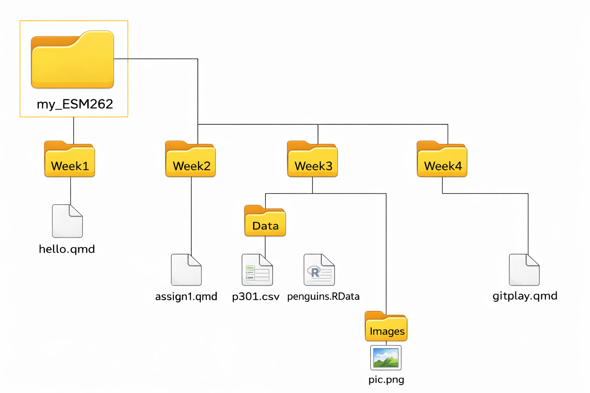

## File Organization

Recall from ESM-206



## Project Folder Organization

-   Depends on project and who you are collaborating with

-   Folders for R scripts for functions (TBD)

    -   must be called R when building a package

-   Sub folders

    -   images
    -   documents
    -   data

-   Organize by project components for complex projects

(see RHESSys example)

-   You might consider having a course project and organize by week (for week1 folder etc)

## Remember the "here" command! {.scrollable}

```{r, setup, echo=TRUE, eval=TRUE, message=FALSE, warning=FALSE}
library(here)
library(tidyverse)
```

```{r, demouse, echo=TRUE, eval=TRUE}
# this will show you the path to your project folder
here()

# this will let you open a file in your project folder
p301 = read.csv(here("downloadables/Data", "p301.csv"))

# lets make month names nicer
p301$month_lab <- factor(p301$month, levels = 1:12, labels = month.abb)

# plot direct solar radiation by month
ggplot(p301, aes(x = month_lab,
                y = direct_solar,
                group = month_lab,
                fill = month_lab)) +
  geom_boxplot() +
  theme_bw() +
  labs(y = "Direct Solar Radiation \n(W/m^2)", x = "Month") +
  theme(legend.position = "none")
```

## Reproducibility

-   Why reproducibility and what does it mean?

-   What is a workflow?

    -   not usually linear
    -   often involves iterative steps
    -   often involves multiple people

## Reproducibility and Git/Github {.scrollable}

[*Version control systems*]{style="color:orange"} help you track all of the changes to your files, (kind of like track changes for data, programs...everything ...and more sophisticated)

[*Git*]{style="color:orange"} is a free and open source distributed version control system. Its the most popular, used by millions

*Git* works with many code-bases not just R

-   Python, C, Java, etc.
-   can be used also for data storage, websites, and more

Developed by programmer (creator of Linux - Linus Torvalds)

[*Github*]{style="color:orange"} platform for managing and sharing *git* repositories - acquired by Microsoft in 2018

## Git Concept


"Artwork by @allison_horst".

## Git Concept More {.scrollable}

[Local Git]{style="color:green"}

-   keep track of changes to your code on your computer
-   when necessary, go back to early versions

[GitHub]{style="color:green"}

-   access your code from different places
-   collaborate with others
    -   others who will use your code
    -   coding together


## The Basics {.scrollable}

[Commit]{style="color:green"}

-   saves the current version locally each commit has a label so you can backtrack if needed
-   you can look at what changes between commits
-   gives you an opportunity to comment on what changes

[Push/Pull]{style="color:green"}

-   **push** integrates any local commits/changes to central GitHub\
-   **pull** integrates any commits/changes from central GitHb to local

[History]{style="color:green"}

-   shows your sequence of commit messages

[Diff]{style="color:green"}

-   shows what changed in a file since last commit

[Revert]{style="color:green"}

-   go back to last commit GitHub's

[Git Guides](https://github.com/git-guides) are a really wonderful resource to refer to!

## Example {.scrollable}

[GitHub Repository that I'll use in this course](https://github.com/naomitague/ESM_262_Examples)

-   Directly under the navigation bar (top-left) you will find the name of the repository

-   next line tells you information about current branch - other branches

-   the Code button gives you the identifier of the repository that you can use to download locally

-   Above the files listing, there is information about the latest commit to this repository

-   On the left, you will have the files and folder names

-   In the middle, the last commit message on this file (or file contained in a folder)

-   On the right, the time stamps of the latest commit

## Lets Try {.scrollable}

[First local Git]{style="color:orange"}

With your partner

-   Create a new R project in Rstudio

    -   Notice all 3 options - particularly what to do if you already have a *Github* repository

    -   For this one - we will create a *local git* first

-   [Check: Create a git repository]{style="color:red"}

-   Make a folder called Week1 - add Assignment 1 repository to that folder

-   Make a Data Directory - copy p301.csv into that directory

## Now create a *GitHub* repo {.scrollable}

[GitHub]{style="color:orange"}

Multiple ways to do this..

Easy from Rstudio, with *usethis* package

Before we start check your status by getting a situation report

```{r, githubstart, echo=TRUE, eval=FALSE}
install.packages("usethis")
usethis::git_sitrep()
```

1.  Create a *GitHub* repo

run the following in the R console

```{r, github, echo=TRUE, eval=FALSE}
install.packages("usethis")
usethis::use_git()        # initializes git
usethis::use_github()     # creates the GitHub repo and links it
```

2.  Go to *GitHub* and check to see that all of your files are in your repo

While you are there review the *GitHub* interface parts...any questions?

# Alternative {.scrollable}

You can also create a repository on *Github* itself and then later link you local repository

*Caution* if you do this, make sure to create the repository without a readme file, otherwise you will have to merge the two repositories (local and remote) which is a little more complicated

::: callout-note
if PAT doesn't work, you can do this **manually**

1.  Create a new repository (no readme file) on *GitHub* - give it a name

2.  in the Terminal window in R studio using

-   git init
-   git add .
-   git commit -m "Initial commit"
-   git branch -M main
-   git remote add origin https://github.com/YOUR_USERNAME/YOUR_REPO.git
-   git push -u origin main
:::

## Workflow - Tracking Changes {.scrollable}

3.  Change something in your Quarto file; you could just add a comment

4.  Save the file

-   see how this shows up in git tab in RStudio

5.  [Commit]{style="color:green"}

    -   your file should have an *M* for modified, check this to "stage" your changes for commit
    -   add a message briefly describing what you changed
    -   commit

6.  Send changes to *github* by [Push]{style="color:green"}

7.  Go to *github* and check to see if your file and recent changes are there

# Adding another file {.scrollable}

1.  Create a new file - another Quatro file that is a demonstration of how to find the total streamflow and total precipitation in each year and % of precip that becomes streamflow and then computes mean and standard deviation of across years. You can use the p301.csv file for this.

If you need a hint on how to do this - here's some R code that you might use in the Quarto file

```{r, totalexample, echo=TRUE, eval=TRUE}
library(here)
library(tidyverse)
# read in the data
p301 = read.csv(here("downloadables/Data", "p301.csv"))

# aggregate by water year
p301_yearly <- p301 %>%
  group_by(wy) %>%
  summarise(total_streamflow = sum(streamflow),
            total_precip = sum(precip),
            percent_streamflow = (total_streamflow / total_precip) * 100)

# calculate mean, range and standard deviation of percent streamflow across year
mean(p301_yearly$percent_streamflow)
range(p301_yearly$percent_streamflow)
sd(p301_yearly$percent_streamflow)
```

2.  Save it into the appropriate directory ( using organized directory structures is good programming practice )

3.  Add it to Git local

    -   go to Git and then commit

    -   find your file, should have a "?", check so that it becomes an "A"

    -   add a commit message

    -   commit

4.  When you are ready Send changes to *github* by pushing

5.  Go to *github* and check to see if your file and recent changes are there

## Correcting Mistakes {.scrollable}

Continue to edit your file but this time add something you don't want

-   make a change and save

-   go to your file and look at the changes

-   click *revert* to get rid of the changes that you don't want

-   look at file to make sure unwanted edit is not there

We will talk about how to get something back *after* you've committed it next class

## A few things to note {.scrollable}

-   there are ways to add *git* and *github* to an existing project [Happy Git is a good resource here](https://happygitwithr.com/existing-github-last)

-   what is *.gitignore*

This file tells *git* the types of files you don't want to track W

-   automatically generated files that collaborators don't need (re-generated by R)
-   really big files you don't want to share
-   private stuff you don't want to share
-   computer specific stuff (usually also auto-generated)
