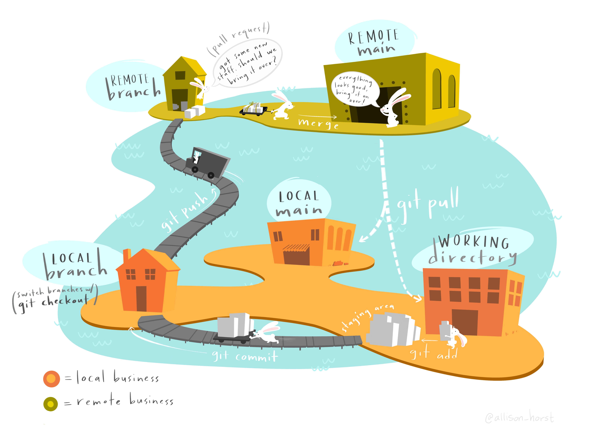
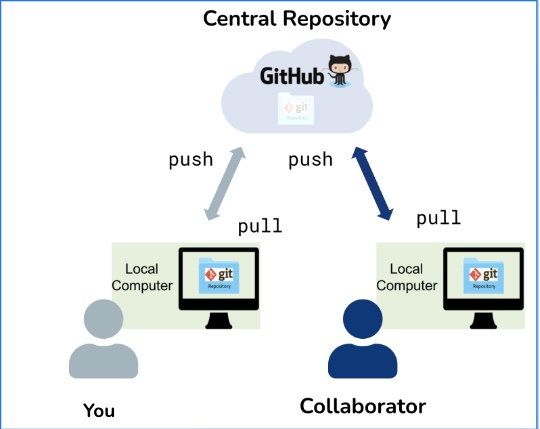

```{r, setup, echo=FALSE, eval=TRUE, message=FALSE, warning=FALSE}
library(here)
library(tidyverse)
```

## Any Questions?

## Git



## Conflicts {.scrollable}

## Branching and Forking

## Getting other repos


## Recall useful Git commands in Terminal {.scrollable}

-   `git status` - shows you the status of your files (which ones are changed, which ones are staged for commit, etc.)

-   `git log` - shows you the commit history with commit messages and IDs

-   `git diff` - shows you the differences between your current files and the last commit (what changes you have made)

-   `git push` - pushes your local commits to GitHub

-   `git pull` - pulls the latest changes from GitHub to your local repository

-   `git commit filename -m "your commit message"` - commits your changes to the file with a message describing what you did.

-   `git commit -a -m "your commit message"` - commits all your changes with a message describing what you did.

-   `git add filename` - stages a file for commit (you need to stage files before you can commit them)

-   `git checkout -- filename` - discards changes in a file and reverts it to the last committed version (use with caution, as this will lose any unsaved changes in that file)

## Collaboration with GitHub



# <span style="color:orange">PACKAGES in R</span>

## <span style="color:orange">Definitions</span>

* **Package**: An extension of the R base system with functions, data and documentation in standardized
format.
* **Library**: A directory containing installed packages.
* **Repository**: A website providing packages for installation.
* **Source**: The original version of a package with human-readable text and code.
* **Binary**: A compiled version of a package with computer-readable text and code, may work only
on a specic platform.
* **Base packages**: Part of the R source tree, maintained by R Core.
* **Recommended packages**: Part of every R installation, but not necessarily maintained by R
Core.
* **Contributed packages**: All the rest. This does not mean that these packages are necessarily of
lesser quality than the above, e.g., many contributed packages on CRAN are written and
maintained by R Core members. They simply try to keep the base distribution as lean as
possible.
* **User packages**: Packages that you write, share with a smaller community - not downloadable
from CRAN, but can be downloaded (or sent as a zip file) and loaded into R

#  <span style="color:orange">Installing User Packages</span>
* looks similar to CRAN packages

* uncompiled (they can be compiled but not always) so  you can **see** the code

You can load my package *rainbow* by 

  * downloading *rainbow.tar.gz *
    * DON'T UNZIP
  
  * install from a *package archive*
  
  
 Alternatively you can install from *github* - you need the *devtools* library to do this
 
 install_github("naomitague/rainbow")
