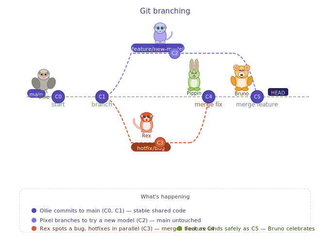

```{r, setup, echo=FALSE, eval=TRUE, message=FALSE, warning=FALSE}
library(here)
library(tidyverse)
```

## Any Questions?

## Git



## Conflicts Review {.scrollable}

-   note that conflicts must be resolved before continuing

-   remember if you really mess up you can *revert* to earlier version

-   frequent *push* and *pull* can help avoid conflicts

## Branching

Sometimes you want to experiment with a new feature or make a change that might break things, could get messy to do this with *commit* and then *revert* if it doesn't work

*Git* thought of this and created *branching*

*Branching* allows you to create a separate version of your code where you can make changes without affecting the main version (called *main* branch)

Later once branch is working you can, if desired, *merge* into *main* branch

## Branching



## Lets try

-   working in your class repo

-   create a new branch called *experiment*

-   add a new quarto document, and in it describe some data analysis that you'd like to experiment with

## Merging

-   in a collaborative project, or if you want to maintain a good copy of your code, you might want to merge branch back into main

-   go back to *main* branch on git

-   *pull* to get any recent changes

-   click *merge* and select the branch you want to merge in

or in terminal

*git merge experiment*

Try it

## Forking

Forking is more removed than branching - it creates a new (copy) of the entire repository under your GitHub account

Forks are their own *repo*

How do forks interact with original? - fork can pull from original repo - to integrate back to original *pull request* is initiated and owner of original decides whether to accept it

Forks are good when you are working independently - might not want to integrate changes - not closely collaborating with owner of original

We won't practice *forks* here but good to know

## Recall useful Git commands in Terminal {.scrollable}

-   `git status` - shows you the status of your files (which ones are changed, which ones are staged for commit, etc.)

-   `git log` - shows you the commit history with commit messages and IDs

-   `git diff` - shows you the differences between your current files and the last commit (what changes you have made)

-   `git push` - pushes your local commits to GitHub

-   `git pull` - pulls the latest changes from GitHub to your local repository

-   `git commit filename -m "your commit message"` - commits your changes to the file with a message describing what you did.

-   `git commit -a -m "your commit message"` - commits all your changes with a message describing what you did.

-   `git add filename` - stages a file for commit (you need to stage files before you can commit them)

-   `git checkout -- filename` - discards changes in a file and reverts it to the last committed version (use with caution, as this will lose any unsaved changes in that file)

-   `git branch branchname` - creates a new branch with the name "branchname"

-   `git checkout branchname` - switches to the branch "branchname"

-   `git merge branchname` - merges the branch "branchname" into the current branch

## Assignment 2: Git and Stream Temperature {.scrollable}

For this assignment, you will work in pairs

First download some USGS data on stream temperature from the Willametter River in Oregon

Here's some R code to download it, \* X_00010_00003 is the water temperature in C

```{r}
#install.packages("dataRetrieval")
library(dataRetrieval)

siteNumbers <- c("14211720", "14211010", "14166000")
parameterCd <- "00010"  # water temperature
startDate <- "2010-01-01"
endDate <- "2023-12-31"

temp_data <- readNWISdv(siteNumbers, parameterCd, startDate, endDate)
# rename columns for clarity
colnames(temp_data) <- c("agency_cd", "site_no", "Date", "temp_C")
# extract some date info for use later
temp_data$month = month(temp_data$Date, label=TRUE)
temp_data$year = year(temp_data$Date)

# check by plotting
ggplot(temp_data, aes(x=Date, y=temp_C, color=site_no)) +
  geom_line() +
  labs(title="Stream Temperature at Willamette River Sites",
       x="Date", y="Temperature (°C)", color="Site Number") +
  theme_minimal()
```

Working together create a new repository that you will share

-   add a quarto file, with nice documentation, that downloads the data (call it something informative)
-   also store the data in the repository (e.g. as a csv or RData file) so that you can work with it without having to download it again
-   in your quarto file, add the option to load the data instead of accessing from NWIS server
-   add a code chunk that plots the data (e.g. using ggplot)
-   add a code chunk that calculates some summary statistics (e.g. mean, max, min temperature for each site)

Make sure you push to *GitHub*.

Now imagine you are working on a project, where you are looking trends in water temperature you want to figure out if a) there is a trend and b) if the slope (trend) is positive (increasing) or negative (decreasing) and c) if there are differences between sites

Have each partner focus on trends for a different month

Here's some example code for how you might compute the trend of temperatures in a given month, the slope of the GLM model will tell you what the trend is (how much temperature increases/decreases per year)

-   Estimate for *year* tells you slope for first site
-   Estimate for *year:site_no14211010*, *year:site_no14211720* tells you how much greater (if positive) slope is for this site relative to first site
-   Estimates for *Intercept* and *site_no14211010*, *site_no14211010* set the baseline temperature to make regression work. You won't use these. (An easier way to look at differences in mean temperature across sites is to calculate means for each)

```{r}
library(tidyverse)
# filter for July temperatures
july_data <- subset(temp_data, month == "Jul")
# fit a GLM model to see if there is a trend in July temperatures over time, separated by site
july_model <- glm(temp_C ~ year*site_no, data = july_data)
summary(july_model)

```

Each partner creates their own branch, and does their own analysis, in a separate quarto document, based on a particular month (e.g. one person does July, another might pick August, etc.) and then pushes to GitHub

Then merge your branches back into main and create a summary document (quarto), that analyzes your finding and adds one plot to illustrate what you think might be the most meaningful result for a manager

Turn in your *GitHub* repo link on Canvas

Grading Rubric

-   Code is well documented and organized (20 points)
-   Created a new repository and added a quarto file with code to download, load, and analyze the data (20 points)
-   Each partner created a branch and analyzed trends for a particular month, correctly interpreting trends in temperature and differences between sites (20 points)
-   Merged branches back into main (20 points)
-   Summary plot and meaningful analysis of your conclusion from the data analysis (20 points)
