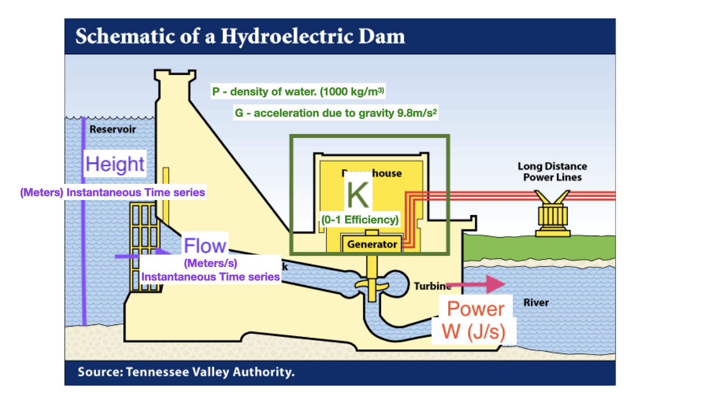

```{r setup, include=FALSE}
knitr::opts_chunk$set(echo =TRUE)
knitr::opts_chunk$set(error=TRUE)
library(tidyverse)
library(here)
```

## Modularity

-   Programs are made up of building blocks
-   A **main program** is a central piece of code that controls the flow and **calls** functions/modules/building blocks


## Functions {.scrollable}

All programming languages have ways to build modules that you can re-use

Lego Blocks 


## Modules - foundation of programming

Breaking tasks into functions is a central programming concept

Often modules are called 'functions' but also called:

  - 'procedures' 
  - 'subroutines' 
  - 'methods' 
  - 'subprograms'

You have already been using functions in R - e.g. mean(), lm(), plot() etc.


## Designing Modularity {.scrollable}

When you start a programming/data science project - you should begin by:

- Breaking your goal down into individual pieces

- Identifying instructions that can be reused

EXAMPLES of Reuse

-   an ecosystem model might re-use instructions for calculating how a living organism grows
  - e.g you might have a function that calculates growth from temperature and moisture and you can re-use this function for different organisms or different species with slightly different inputs
  
-   an accounting program might re-use instructions for computing net present value from interest rates, that you can re-use for different projects or different time periods

## Designing Modularity {.scrollable}

Modules often become ‘black boxes’ which hides detail that might make understanding the program overly complex

Most languages have lots of black boxes already written AND most allow you to write your own


## Inputs and Parameters {.scrollable}

All functions/modules have **inputs/parameters** and **outputs**

**Inputs** — what you give the function - sometimes separated into input data and parameters

-   input data = the “what” that is manipulated
-   parameters determine “how” the manipulation is done

##   an example of a R black box function

-**sort**

-   inputs - data stream

-   parameters - how to do the sort

## In code {.scrollable}

```{r eval=TRUE, echo=TRUE  }

# look at a R data set on Biological Oxygen Demand over time

# notice the use of data - R function that brings pre-stored datasets into the work space
data(BOD)

# notice "help" and the information that it provides
help(BOD)

# options for looking at data
view(BOD)

head(BOD)

# example of a function - SORT
result = sort(BOD[,"demand"], decreasing=TRUE, method="quick")
head(result)
```

In this example, parameters are **decreasing** and **method** - they determine how the function works

**inputs* are the data to be sorted

*Note*  sometimes parameters can influence how the functions works (e.g method)

Output is a sorted version of demand saved to `result`.


## Learn to think in terms of functions/modules

-   break your tasks into boxes with inputs, parameters and output
-   **WRITE DOWN** the *contract* for each box/function

**CONTRACT**

-   if the users gives you A, the function with return B
-   specify A and B as precisely as you can (include units, time/space scale, parameters, options)

## A simple function example - just one module 

Lets say we want to develop a function that computes power generated from hydro-reservoir

We know that power generation depends on water release rates and the potential energy (from the reservoir height)

## STEPS IN Program Design {.scrollable}

1.  Clearly define your goal in words/figures as precisely as possible what do you want your program to do
    -   decide on modules
    -   for each module, write a contract - inputs, outputs and what it will do
2.  Implement AND document as you go
3.  Test
4.  Refine
5.  Test again
6.  Create User Documentation and Distribute

## A simple function example {.scrollable}

Power generation from a reservoir



## First describe the 'contract' in natural language  {.scrollable}

Contract

*Input*: Reservoir height (m) and flow rate (m3/sec) (these inputs could be  a single value in time or a time series)

*Output*: Instantaneous power generation (W/s) (as a single value or value for each reservoir height and flow rate combination)

*Parameters*: $K_{Eff}$ reservoir efficiency, ρ (density of water), $g$ (acceleration due to gravity)

## What the function will do {.scrollable}

compute power using the following equation - *body* of the function

$P = ρ * h * r * g * K_{Eff}$

- *P* is Power in watts,
- *ρ* is the density of water (\~1000 $kg/m^3$)
- *h* is height in meters, 
- *r* is flow rate in cubic meters per second, 
- *g* is acceleration due to gravity of 9.8 $m/s^2$, 
- $K_{Eff}$ is a coefficient of efficiency ranging from 0 to 1.

## Implementing Functions in R

Format for a basic function in R

::: {style="color: green;"}

Some lines at the top that start with \#' 

these are documentation that describes inputs, outputs and what the function does

we will talk more about that - for now just follow the example, below

::: 

This is followed by the function definition 

::: {style="color: orange;"}

*Function Name* = function(inputs, parameters) {

body of the function (manipulation of inputs)

return(values to return)

}
::: 

You can name the function what every you want

- try not to use names of function in R, like *mean*
- try to use descriptive names that give a hint about what the function does


## Implementing Functions in R {.scrollable}

In R, inputs and parameters are treated the same; but it is useful to think about them separately in designing the model - collectively they are sometimes referred to as arguments

ALWAYS USE Meaningful names for your function, its parameters and variables calculated within the function

-   In R we combine inputs/parameters in the first line of the function definition

-   we can provide "default" values that can be overwritten by the function user

-   [Body]{style="color:green"} includes all calculations between { and }

    -   anything inside the body is not "seen" by the workspace so you can re-use variables

-   [return]{style="color:green"}* tells R what the output is

## Here's our example {.scrollable}

 You could just write you function in-line  

But best practice to keep as a file

## Lets look at both options

1. open power_gen_orig.R and look at the function definition
2. see how to read in the function from a file and use it
3. see how to write the function in-line

Before you start download the file **power_gen_orig.R** from the course github site and save it in a directory on your computer - you will need to change path to read it in 


```{r eval=TRUE, echo=TRUE  }

library(here)
# source the function from a file - make sure you are in the right working directory
source(here("course-materials/R/power_gen_orig.R"))

# alternatively
# function definition in-line
power_gen_orig = function(height, flow, rho=1000, g=9.8, Keff=0.8) {
result = rho * height * flow * g * Keff
return(result)
}

# note that height and flow don't have default values, so you must provide them when you use the function, but the other parameters have default values that you can overwrite if you want to

```

## Using the function and scoping {.scrollable}

To use the function we substitute "actual" values for each argument (parameter and inputs) (unless there are defaults)

R assumes that arguments are in the order that they were specified in the function definition - unless you refer to them by name


## Example

```{r eval=TRUE, echo=TRUE  }

# This use of the function
power_gen_orig(20,1)

# is the same as this
power_gen_orig(height=20, flow=1)

# or this; where we use the names of the arguments to specify which is which - this is especially useful if you have a lot of arguments and don't want to remember the order
power_gen_orig(flow=1, height=20)

# change the defaults
# what if efficiency is less

power_gen_orig(20,1, Keff=0.2)

```


## Scoping {.scrollable}

The scope of a variable in a program defines where it can be “seen” Variables defined inside a function cannot be “seen” outside of that function

There are advantages to this - the interior of the building block does not ‘interfere’ with other parts of the program

## See how scoping works {.scrollable}


```{r eval=TRUE, echo=TRUE  }

# specifying function name without () shows code
# try it for internal R functions
power_gen_orig

# use the function and save the results
reservoir1 = power_gen_orig(height=4, flow=7)

reservoir2 = power_gen_orig(height=4, flow=7, Keff=0.2)

# note that internal variables are not defined so these R statements will FAIL
# try it
height
Keff
results

# only the outputs are in your workspace
reservoir1
reservoir2


```


## Some conventions (helpful later in the course) {.scrollable}

-   Always write your function in a text editor and then copy into R

-   By convention we name files with functions in them by the name of the function.R e.g. **power_gen_orig.R**

-   you can have R read a text file by source(“power_gen.R”) - make sure you are in the right working directory

-   keep organized by keeping all functions in a subdirectory called *R*

## More best practices {.scrollable}

-   Include comments both in the body of the function and at the top - there is a particular style of adding comments to the top of the function that we will use later to generate automatic documentation - so useful to start to follow it, more or less, now - see **power_gen_orig.R** for the style

-   Eventually we will want our function to be part of a package (a library of many functions) - to create a package you must use this convention (name.R) place all function in a directory called “R”

## reading in functions

Example - source and use function

```{r}
library(here)
source(here("course-materials/R/power_gen_orig.R"))
power_gen_orig(20,1)
```

## Practicing - Assignment 4

Complete Assignment 4! before Thursday's Lecture
