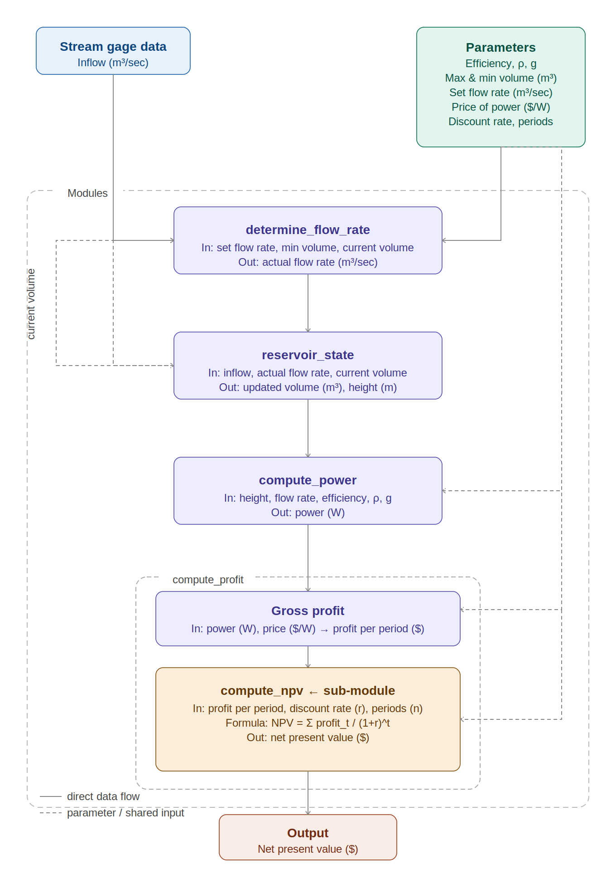

```{r, setup, echo=FALSE, eval=TRUE, message=FALSE, warning=FALSE}
library(here)
library(tidyverse)
```

## [Agenda for Today]{style="color:orange"}

- a bit more on using functions with data

  - sometimes you don't need loops

- modularity - putting functions together

- project!

## [Vectors and Functions]{style="color:orange"} {.scrollable}

- we often want to 'run' our function over multiple inputs

  - many citizen scientists contributing to species data collection in different locations

- Generally vector arithmetic doesn't require a *for* loop (in most languages)

- R has many ways to *loop* over data

  - we will cover several
  - simplest vector arithmetic (built in)

```{r}
# example
a <- c(1, 2, 3)
b <- c(4, 5, 6)
a + b
# sum is done for each element of the vector
```

## [Implicit Iteration]{style="color:orange"}

If calculations in the function can be done as vectors - this is automatic

e.g. parallel rows for each variable

## [HydroPower Example]{style="color:orange"} {.scrollable}

Contract

*Input*: Reservoir height (m) and flow rate (m3/sec) (as a single value in time or a time series)

*Output*: Instantaneous power generation (W/s) (as a single value or value for each reservoir height and flow rate combination)

*Parameters*: KEff, ρ (density of water), g (acceleration due to gravity)

What the function will do - compute power using the following equation - *body* of the function

P = ρ \* h \* r \* g \* KEff;

P is Power in watts, ρ is the density of water (\~1000 kg/m3), h is height in meters, r is flow rate in cubic meters per second, g is acceleration due to gravity of 9.8 m/s2, KEff is a coefficient of efficiency ranging from 0 to 1.

## [Application with Vectors]{style="color:orange"} {.scrollable}

```{r eval=TRUE, echo=TRUE  }

library(here)
library(tidyverse)
# source the function from a file - make sure you are in the right working directory
source(here("course-materials/R/power_gen_orig.R"))
power_gen_orig(flow=2,height=5)

# Vectors of flow and height
flow = runif(min=1, max=10, n=20)
height = runif(min=5, max =30, n=20)

power = power_gen_orig(flow, height)
power
length(power)
length(flow)

# what if lengths are unequal - unclear results
height = c(0,1)
power = power_gen_orig(flow, height)
# it works but what is it doing?
 power
 
# unclear behaviors - best to not do it
# helps to define a data frame
powerdf = data.frame(
flow = runif(min=1, max=10, n=20),
height = runif(min=5, max =30, n=20)
)

# this works
 powerdf$highK = power_gen_orig(flow, height, K=0.4)
 powerdf$lowK = power_gen_orig(flow, height, K=0.9)
 mean(powerdf$lowK)
 mean(powerdf$highK)

# helpful for graphing

 ggplot(powerdf, aes(x = flow, y = highK))+
   geom_line() + geom_line(aes(x=flow, y=lowK), col="blue")
 
 # but note this gives unclear results
tmp =  power_gen_orig(flow, height, Keff = c(0.6,0.8))
```

## [Loops and Functions]{style="color:orange"} {.scrollable}

Calculate NPV for

- a range of different interest rates and
- a range of damages
- that may be incurred 10 years in the future

**Steps**

- define inputs (interest rates, damages)
- define output (NPV)
- write the function
- create a data structure to store results where we vary both interest rates and damages
- use nested for loops to fill in the data structure

Try it first...

## [NPV: Nested For Loop Example]{style="color:orange"} {.scrollable}

```{r npvfor, echo=TRUE, error=FALSE}

# write a function to compute npv
source(here("course-materials/R/compute_NPV.R"))
compute_NPV
compute_NPV(20, discount=0.01, time=20)


# generate some input
damages = c(25,33,91,24)
damages
# sensitivity to discount rate
discount_rates = seq(from=0.01, to=0.04, by=0.005)
discount_rates
yr=10

# simple vectorization doesn't give all combinations -
# R recycles the shorter vector (gives 7 results with a warning, not 4x7=28)
compute_NPV(value=damages, discount=discount_rates, time=yr)

# compute npv's for all combinations of damages and discount rates
# first generate a dataframe to store results - rows = damages, columns = discount rates
npvs = data.frame(matrix(nrow=length(damages), ncol=length(discount_rates)))

# here we have a 2-dimensional array - rows and columns
head(npvs)

# now use a nested for loop to populate
for (i in 1:length(damages)) {
  for (j in 1:length(discount_rates)) {
    npvs[i,j] = compute_NPV(value=damages[i], discount=discount_rates[j], time=yr)
  }
}
npvs

# some data wrangling to make it pretty
colnames(npvs) = discount_rates
rownames(npvs) = damages
npvs

# how do I plot this with ggplot - add a column for original value and then rearrange
npvs$damage = damages
npvsg = npvs %>% pivot_longer(!damage, names_to="dis", values_to="npv")
head(npvsg)
ggplot(npvsg, aes(x=damage, y=npv, col=dis))+geom_point()+labs(col="Discount\nRate")

# how about summing all the damages
npv.total = npvsg %>% group_by(dis) %>% summarize(t=sum(npv))
ggplot(npv.total, aes(dis,t, fill=dis))+geom_col() + labs(x="Discount Rate", y="Total ($)")

```

## [Programming Always Starts with]{style="color:orange"}

[Conceptual Design]{style="color: cyan;"}

- What is the goal
- How can you break this goal into sub-tasks
- For the overall project and each sub-task
  - What are the inputs
  - What are the outputs

## [Modularity]{style="color:orange"}

- Programs are made up of building blocks
- A **main program** that controls the flow and **calls** functions/modules/building blocks

## [Modules Take You from Inputs to Outputs in Pieces]{style="color:orange"}

- helpful to start a software engineering project by **diagramming** or **flow charting** your program

- what is the goal

- what are key building blocks - modules or functions

- inputs and outputs

- how do you put the blocks together to go from input to output - main program

## [Flow Chart Example]{style="color:orange"}

[Flow chart Example](https://images.app.goo.gl/ktxjSGC2Dyi1WQFA6)

# [Designing Modularity]{style="color:orange"}

Breaking your instructions down into individual pieces

Identifying instructions that can be reused

EXAMPLES

- an accounting program might re-use instructions for computing net present value from interest rates

## [Inputs versus Parameters]{style="color:orange"}

**Inputs** — sometimes separated into input data and parameters

- input data = the "what" that is manipulated
- parameters determine "how" the manipulation is done

## [Steps in Program Design]{style="color:orange"} {.scrollable}

For each module and the overall program design:

1.  Clearly define your goal in words/figures as precisely as possible — what do you want your program to do

    - input/output of the entire program
    - modules
      - inputs/parameters
      - outputs
    - flow between modules

2.  Implement AND document as you go

3.  Test

4.  Refine

5.  Test again

6.  Create user documentation and distribute

## [Learn to Think in Terms of Functions/Modules]{style="color:orange"}

- break your tasks into boxes with inputs, parameters and outputs
- **WRITE DOWN** the *contract* for each box/function

**CONTRACT**

- if the user gives you A, the function will return B
- specify A and B as precisely as you can (units, time/space scale, parameters, options)

## [A Simple Function Example - Just One Module]{style="color:orange"}

Let's say we want to develop a program that computes power generated from a hydro-reservoir

We know that power generation depends on water release rates and the potential energy (from the reservoir height)

## [Let's Break It Down]{style="color:orange"} {.scrollable}

Contract

*Input*: Reservoir height (m) and flow rate (m3/sec) (as a single value in time or a time series)

*Output*: Instantaneous power generation (W/s) (as a single value or value for each reservoir height and flow rate combination)

*Parameters*: KEff, ρ (density of water), g (acceleration due to gravity)

What the function will do - compute power using the following equation - *body* of the function

P = ρ \* h \* r \* g \* KEff;

P is Power in watts, ρ is the density of water (\~1000 kg/m3), h is height in meters, r is flow rate in cubic meters per second, g is acceleration due to gravity of 9.8 m/s2, KEff is a coefficient of efficiency ranging from 0 to 1.

## [Let's Think About a More Complex Program...]{style="color:orange"} {.scrollable}

- Goal - Calculate profit from a reservoir fed by a river, if a minimum reservoir volume must be maintained and otherwise the reservoir is operated at a flow rate set by the user

*Input* Stream gage data (m3/sec)

*Parameters* Efficiency, ρ (density of water), g (acceleration due to gravity), Maximum Reservoir Capacity $(m^3)$, Minimum Reservoir Volume $(m^3)$, Set flow rate $(m^3/sec)$, Price of power $($/W)\$

*Output* Profit (\$)

## Modules

*Modules*

- Compute Power from a given reservoir height and flow rate (compute_power)
- Keep track of reservoir volume given inflow and output (reservoir_state)
- Determine flow rate, given operator desired flow rate but need for minimum capacity (determine_flow_rate)
- Compute profit from power (compute_profit)

Each module would have its own inputs, parameters and output

Flow control diagram - puts the modules together

## [Here's the Diagram]{style="color:orange"}



# [Making Diagrams]{style="color:orange"}

There are many options for making flow charts or diagrams to support your programming

I like this free one accessible online from Chrome:

[Diagram.net](https://www.diagrams.net/)

## [Project - Assignment 5]{style="color:orange"} {.scrollable}

With a partner

Think of an example complex data science task/program that you might want to design with:

- at least 3 modules
- 1 module must be used at least twice
- at least one *for* (or *while*) loop

*Planning - Step 1*

- sketch a diagram that shows how these modules would be put together to go from inputs to output for the overall program (30pts)
- write a contract for the overall program (input, output, parameters) (10pts)
- break the program into modules (naming them appropriately), write a contract for each one (20pts)

**Important - Check in with myself or Ojas to get the OK on your plan BEFORE you go to Step 2**

*Implementation - Step 2*

- write functions (stored in separate documents) for each module (30pts)
- write an overall program that manages *calls* to each function (10pts)
- create some data and use it to test the program (10pts)
