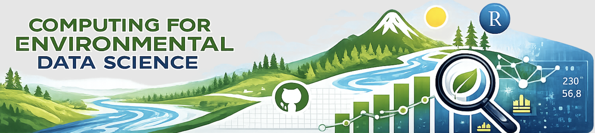
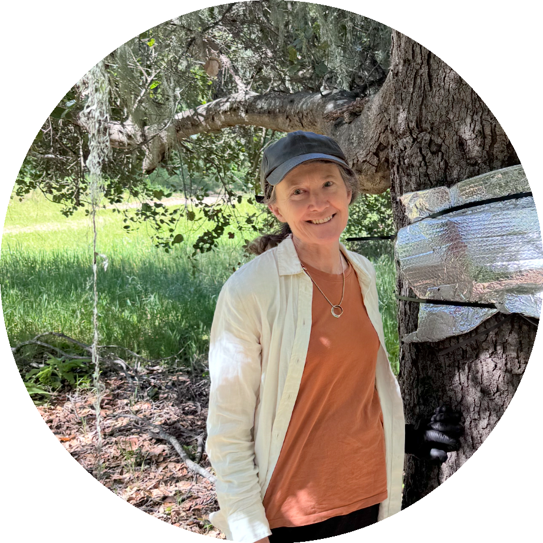

::: {.center-text}
{width="80%" fig-alt="ESM 262 Logo"}
:::

::: {.center-text .gray-text}

:::

<br>

::: {.callout-tip}
### Course Stuff:

* Use this web page to find lecture slides, assignment details, materials and due data, example code and data files, references to learn more

* I will update the web-page before each lecture to add in new materials, so refresh frequently

* Quizes, Surveys and Assignments will be turned in on Canvas and grades posted there - all course info will be here
:::

## Course Description

An introduction to computing for environmental applications. The course provides practical training in some core programming skills and best practices for data science and software design. The course features **R** for programming, **Git** for version control, **Quarto** for workflow and editing, and **GitHub** for collaboration and publishing, but many concepts would be applicable in other software design tools. 

## Teaching Team

<br>

<!-- Create responsive grid with two columns, which stack vertically when browser window is made smaller (or when viewed on a mobile device) -->

::: {.grid}

<!-- Left-hand column -->
::: {.g-col-12 .g-col-md-6}
::: {.center-text .body-text-l}
**Instructor**
:::
```{r}
#| eval: true 
#| echo: false
#| fig-align: "center"
#| out-width: "45%" 

```
::: {.center-text}
[**Naomi Tague**]{.teal-text}  
**Email:** [tague@ucsb.edu](mailto::tague@bren.ucsb.edu)  
**Learn more:[Tague Team Lab](www.tagueteamlab.org)
:::
:::

<!-- Right-hand column -->
::: {.g-col-12 .g-col-md-6}
::: {.center-text .body-text-l}
**TA**
:::
```{r}
#| eval: true 
#| echo: false
#| fig-align: "center"
#| out-width: "45%" 
knitr::include_graphics("images/tbd.png")
```
::: {.center-text}
[**Ojas Sarup**]{.teal-text}  
**Email:** [ojassarup@ucsb.edu](mailto::ojassarup@ucsb.edu)   

:::
:::

:::

## Acknowledgements

Special thanks to Samantha Shanny-Csik for web-page template and MEDS curriculum committee for inputs on course content.