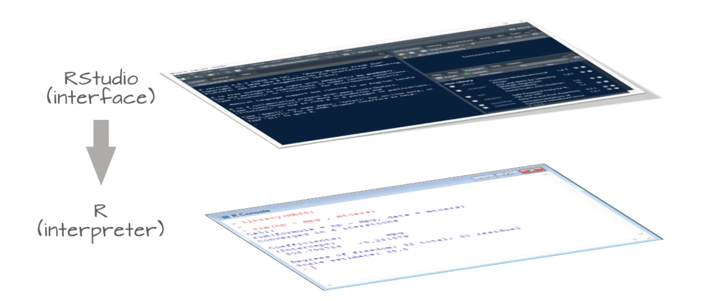
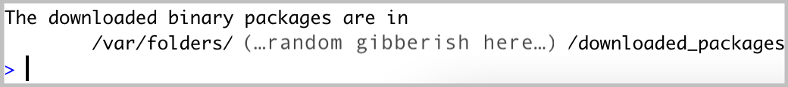
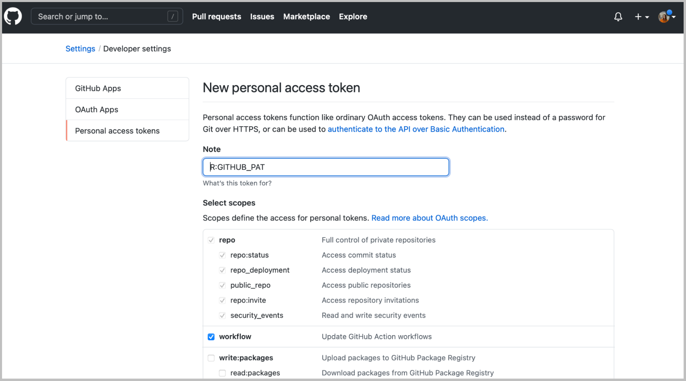
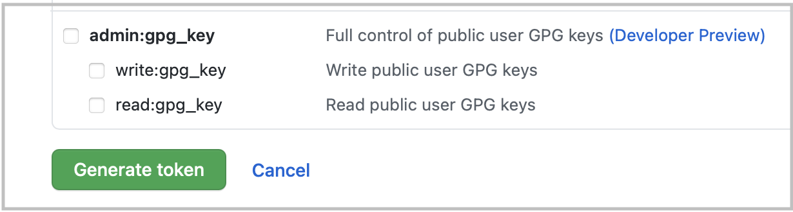
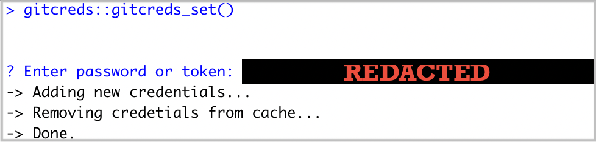
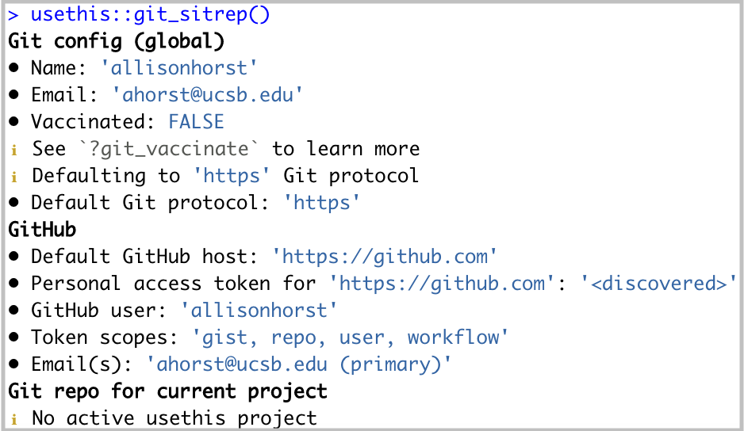

### 1. Install or update R {#install-R}

Visit [cloud.r-project.org](https://cloud.r-project.org/) to download the most recent version of R for your operating system. You should have *at least* version 4.4.0 (released 2024-04-24) running when you start MEDS.

### 2. Install or update RStudio {#install-RStudio}

While R is a programming language, RStudio is a software (often referred to as an IDE, **I**ntegrated **D**evelopment **E**nvironment) that provides R programmers with a neat, easy-to-use interface for coding in R. There are a number of IDEs out there, but RStudio is arguably the best and definitely most popular among R programmers.

:::: callout-note
## NOTE: You need *both* R and RStudio installed

RStudio will not work without R installed, and you won't particularly enjoy using R without having RStudio installed. Be sure to install *both*!

```{r}
#| echo: false
#| fig-align: "center"

```

::: {.center-text .gray-text}
Image Credit: [Exploratory Data Analysis in R](https://mgimond.github.io/ES218/), by Manny Gimond
:::
::::

-   **New install:** To install RStudio, visit [rstudio.com/products/rstudio/](https://www.rstudio.com/products/rstudio/). Download the free (“Open Source Edition”) Desktop version for your operating system. You should install the most up-to-date version available that is supported by your operating system.

-   **Update:** If you already have RStudio and need to update, open RStudio, and under *Help* (in the top menu), choose *Check for updates*. If you have the most recent release, it will return *No update available. You are running the most recent version of RStudio*. Otherwise, you should follow the instructions to install an updated version.

-   Open RStudio (click on the logo shown below):

```{r}
#| echo: false
#| fig-align: "center"
#| out-width: "15%"

```

::: callout-note
## Note for  *Mac* users: you may need to install command line tools and XQuartz.

**If upon opening RStudio you are prompted to install Command Line Tools, do it.**

-   **To install command line tools** (if you’re not automatically prompted), run `xcode-select --install` in the RStudio Terminal
-   **To install XQuartz,** visit [xquartz.org](https://www.xquartz.org/)

*(Note for*  *Windows users: Windows machines should already have command line tools installed, and XQuartz is only required for Macs).*
:::

### 3. Install Quarto *if necessary* (automatically installed with RStudio) {#Quarto}

Quarto is a scientific publishing tool built on Pandoc that allows R, Python, Julia, and ObservableJS users to create dynamic documents, websites, books and more. Don't worry if you don't know what all of these are - we will use it to create documents with Rstudio.

Quarto is included with RStudio v2022.07.1+ **so there no need for a separate download/install** if you have the latest version of RStudio! You can find all releases (current, pre, and older releases) on the Quarto website [download page](https://quarto.org/docs/download/), should you want/need to reference them.


## WAIT ON THIS UNTILL WE GET TO GIT IN COURSE 

Later in the course we will learn about using *Git* and *Github*  
for reproducibility, collaboration and tracking code changes

Setting up requires some use of the *terminal* in Rstudio,
if you are familiar with that you can go ahead and set up - otherwise
wait and we will take you through

### 4. Git  -  {#check-git}


-   Check to see if *git* is installed

-   Open RStudio

-   In the Terminal, run the following command (choose the option for your operating system):

::: panel-tabset
##  Mac

```{bash filename="RStudio Terminal"}
#| eval: false
which git
```

##  Windows

```{bash filename="RStudio Terminal"}
#| eval: false
where git
```
:::

-   If you get something that looks like a file path to git on your computer (e.g. `/usr/local/bin/git` on a Mac, `C:\Program Files\Git\mingw64\bin\git.exe` on Windows, though it could differ slightly on your computer), then you have git installed. If you instead get no response at all, you should download & install git here: [git-scm.com/downloads](https://git-scm.com/downloads)


### 5. Create a GitHub account {#GitHub}

-   If you don’t already have a GitHub account, go to <https://github.com> and create one. Check out Jenny Bryan's [Happy Git with R, Ch. 4](https://happygitwithr.com/github-acct.html) for some helpful considerations when choosing a username. We suggest that you use a *personal email* or your @bren.ucsb.edu email when setting up your account (rather than your @ucsb.edu *email*, which will be deactivated after you graduate).

### 6. Configure git {#configure-git}

-   In RStudio, open the Terminal. Run the following commands (by pressing **return** after each line). Be sure to replace the username (keep the quotation marks!) with *your* GitHub username and the email with the email you used for your GitHub account.

```{bash filename="RStudio Terminal"}
#| eval: false
git config --global user.name "Jane Doe"
git config --global user.email janedoe@example.com
```

-   Then, in the Terminal run the following, and carefully check that the name and email returned match your GitHub information:

```{bash filename="RStudio Terminal"}
#| eval: false
git config --list --global
```

::: callout-important
## IMPORTANT: If you're configuring git on a **Bren server** (e.g. workbench-1.bren.ucsb.edu or workbench-2.bren.ucsb.edu), you must also run the following in the Terminal

```{bash filename="RStudio Terminal"}
#| eval: false
git config --global credential.helper 'cache --timeout=10000000'
```

This prevents important credentials (e.g. a GitHub Personal Access Token, PAT, which you'll set in step #7) from being removed from the server's memory. You **do not** need to complete this step when configuring git on your local computer.
:::

### 7. Store your GitHub personal access token (PAT) {#GitHub-PAT}

**First:** What even is a personal access token? From GitHub's documentation:

> Personal access tokens (PATs) are an alternative to using passwords for authentication to GitHub when using the [GitHub API](https://docs.github.com/en/rest/overview/other-authentication-methods#via-oauth-and-personal-access-tokens) or the [command line](https://docs.github.com/en/authentication/keeping-your-account-and-data-secure/creating-a-personal-access-token#using-a-token-on-the-command-line).

This means that in order to push your work (files, scripts, etc.) from your laptop (or any other computer) to GitHub, you'll need to first to generate a PAT. **Importantly, you'll need to generate a PAT for each computer you wish to work from.** For example, we will complete the following steps to create a PAT for your personal laptop, but you'll also need to create a PAT if/when you choose to work on a second computer at home or any of the Bren servers. Good news is that you can follow these same steps when you're ready to set up additional PATs on other machines. For now, let's get a PAT for our personal laptop squared away:

-   Once you have git configured successfully, install the `{usethis}` package in R by running the following in the RStudio Console:

```{r filename="RStudio Console"}
#| eval: false
install.packages("usethis")
```

A lot of scary looking red text will show up while this is installing - don’t panic. If you get to the end and see something like below (with no error) it’s installed successfully.

```{r}
#| echo: false
#| fig-align: "center"

```

-   Run the following in the RStudio Console:

```{r filename="RStudio Console"}
#| eval: false
usethis::create_github_token() 
```

-   Enter your GitHub password if/when prompted. You’ll be taken to a screen that looks like this:

```{r}
#| echo: false
#| fig-align: "center"

```

-   In the **Note** field, you should see some autopopulated text: `R:GITHUB_PAT`. We suggest changing this to something that signifies what machine it's being used for. For example, if you are generating a PAT for your laptop, you might choose to rename it, `My Personal Laptop`.

-   Next, you'll see a section called **Select scopes** with reasonable options already selected for you. Do not change anything. Just scroll down to the bottom of that page and click the green **Generate token** button:

```{r}
#| echo: false
#| fig-align: "center"

```

-   Copy the generated PAT to your clipboard

-   Back in RStudio, run the following in the Console:

```{r filename="RStudio Console"}
#| eval: false
gitcreds::gitcreds_set()
```

This will prompt you to paste the PAT you just copied from GitHub. Paste the PAT, press Enter to run. You should see something like this show up if all is well so far (you’ll have pasted your PAT where the example below says “REDACTED”):

```{r}
#| echo: false
#| fig-align: "center"

```

-   In the RStudio Console, run:

```{r filename="RStudio Console"}
#| eval: false
usethis::git_sitrep()
```

Does it return information about your connected GitHub account that looks something like below? Great! You’ve configured git and successfully stored your PAT.

```{r}
#| echo: false
#| fig-align: "center"

```

::: callout-note
## **A note on expiring tokens:**

Setting an expiration date on personal access tokens is highly recommended in order to keep your information secure. GitHub will send you an email when it's time to regenerate a token that's about to expire. Follow the email prompts, then use `gitcreds::gitcreds_set()` to reset your token.
:::


### 8. Install Cyberduck {#install-Cyberduck}

Cyberduck is a program that allows you to browse files on a remote server. [Download here](https://cyberduck.io/).

### 9. Install UCSB's Ivanti Campus VPN (Virtual Private Network) {#install-VPN}

You probably already did this - but just in case!

For secure remote access to the UCSB's campus network when you're not physically present on campus, you'll need to download and install the Ivanti VPN client. This will allow you to access UCSB's technology resources (including servers, journal subscriptions, etc.) anytime and from anywhere.

See this [UCSB Information Technology article](https://it.ucsb.edu/network-infrastructure-services/ivanti-connect-secure-campus-vpn) for directions on how to get started.


::: {.center-text .body-text-l .dark-blue-text}
***\~ END Installation Guide \~***
:::

<br>